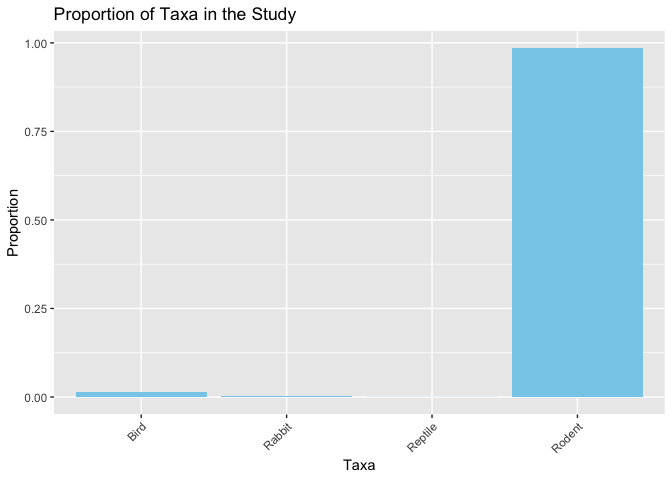
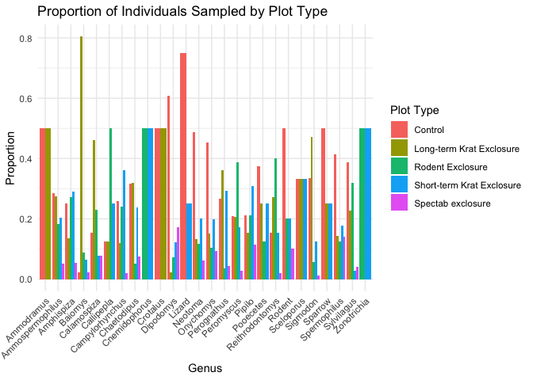
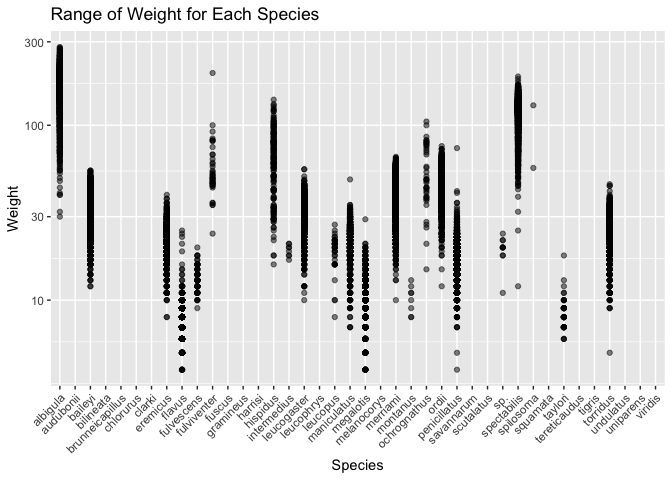
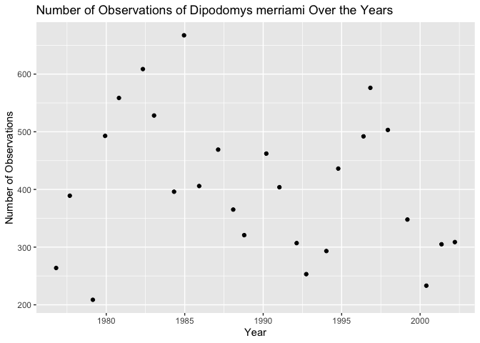
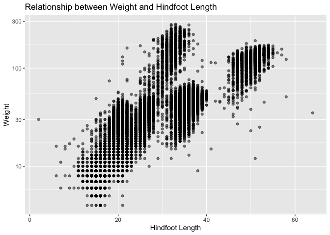
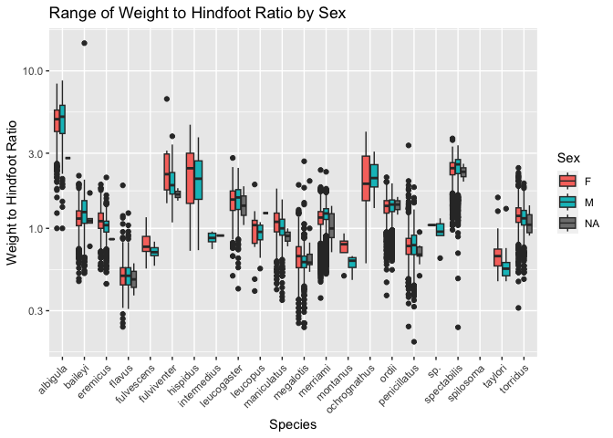
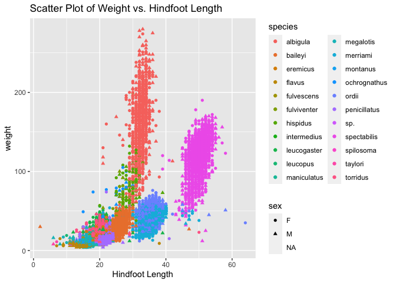

## Instructions
Answer the following questions and complete the exercises in RMarkdown. Please embed all of your code and push your final work to your repository. Your final lab report should be organized, clean, and run free from errors. Remember, you must remove the `#` for the included code chunks to run. Be sure to add your name to the author header above. For any included plots, make sure they are clearly labeled. You are free to use any plot type that you feel best communicates the results of your analysis.  

Make sure to use the formatting conventions of RMarkdown to make your report neat and clean!  

## Load the libraries

```r
library(tidyverse)
library(janitor)
library(naniar)
```

## Desert Ecology
For this assignment, we are going to use a modified data set on [desert ecology](http://esapubs.org/archive/ecol/E090/118/). The data are from: S. K. Morgan Ernest, Thomas J. Valone, and James H. Brown. 2009. Long-term monitoring and experimental manipulation of a Chihuahuan Desert ecosystem near Portal, Arizona, USA. Ecology 90:1708.

```r
deserts <- read_csv("data/surveys_complete.csv") %>% clean_names()
```

```
## Rows: 34786 Columns: 13
## ── Column specification ────────────────────────────────────────────────────────
## Delimiter: ","
## chr (6): species_id, sex, genus, species, taxa, plot_type
## dbl (7): record_id, month, day, year, plot_id, hindfoot_length, weight
## 
## ℹ Use `spec()` to retrieve the full column specification for this data.
## ℹ Specify the column types or set `show_col_types = FALSE` to quiet this message.
```

1. Use the function(s) of your choice to get an idea of its structure, including how NA's are treated. Are the data tidy?  


```r
glimpse(deserts)
```

```
## Rows: 34,786
## Columns: 13
## $ record_id       <dbl> 1, 2, 3, 4, 5, 6, 7, 8, 9, 10, 11, 12, 13, 14, 15, 16,…
## $ month           <dbl> 7, 7, 7, 7, 7, 7, 7, 7, 7, 7, 7, 7, 7, 7, 7, 7, 7, 7, …
## $ day             <dbl> 16, 16, 16, 16, 16, 16, 16, 16, 16, 16, 16, 16, 16, 16…
## $ year            <dbl> 1977, 1977, 1977, 1977, 1977, 1977, 1977, 1977, 1977, …
## $ plot_id         <dbl> 2, 3, 2, 7, 3, 1, 2, 1, 1, 6, 5, 7, 3, 8, 6, 4, 3, 2, …
## $ species_id      <chr> "NL", "NL", "DM", "DM", "DM", "PF", "PE", "DM", "DM", …
## $ sex             <chr> "M", "M", "F", "M", "M", "M", "F", "M", "F", "F", "F",…
## $ hindfoot_length <dbl> 32, 33, 37, 36, 35, 14, NA, 37, 34, 20, 53, 38, 35, NA…
## $ weight          <dbl> NA, NA, NA, NA, NA, NA, NA, NA, NA, NA, NA, NA, NA, NA…
## $ genus           <chr> "Neotoma", "Neotoma", "Dipodomys", "Dipodomys", "Dipod…
## $ species         <chr> "albigula", "albigula", "merriami", "merriami", "merri…
## $ taxa            <chr> "Rodent", "Rodent", "Rodent", "Rodent", "Rodent", "Rod…
## $ plot_type       <chr> "Control", "Long-term Krat Exclosure", "Control", "Rod…
```

2. How many genera and species are represented in the data? What are the total number of observations? Which species is most/ least frequently sampled in the study?


```r
deserts %>% distinct(genus) 
```

```
## # A tibble: 26 × 1
##    genus          
##    <chr>          
##  1 Neotoma        
##  2 Dipodomys      
##  3 Perognathus    
##  4 Peromyscus     
##  5 Chaetodipus    
##  6 Sigmodon       
##  7 Onychomys      
##  8 Spermophilus   
##  9 Reithrodontomys
## 10 Sylvilagus     
## # ℹ 16 more rows
```

```r
deserts %>% distinct(species)
```

```
## # A tibble: 40 × 1
##    species     
##    <chr>       
##  1 albigula    
##  2 merriami    
##  3 flavus      
##  4 eremicus    
##  5 spectabilis 
##  6 penicillatus
##  7 hispidus    
##  8 torridus    
##  9 ordii       
## 10 sp.         
## # ℹ 30 more rows
```

```r
deserts %>% count(species) %>% arrange(desc(n))
```

```
## # A tibble: 40 × 2
##    species          n
##    <chr>        <int>
##  1 merriami     10596
##  2 penicillatus  3123
##  3 ordii         3027
##  4 baileyi       2891
##  5 megalotis     2609
##  6 spectabilis   2504
##  7 torridus      2249
##  8 flavus        1597
##  9 eremicus      1299
## 10 albigula      1252
## # ℹ 30 more rows
```

26 genera and 40 species. Viridis and merriami are least and most. 
3. What is the proportion of taxa included in this study? Show a table and plot that reflects this count.


```r
taxa_proportion <- deserts %>% count(taxa) %>% mutate(proportion = n / sum(n))
tabyl(deserts$taxa)
```

```
##  deserts$taxa     n      percent
##          Bird   450 0.0129362387
##        Rabbit    75 0.0021560398
##       Reptile    14 0.0004024608
##        Rodent 34247 0.9845052607
```

```r
taxa_proportion %>% 
  ggplot(aes(x = taxa, y = proportion)) +
  geom_bar(stat = "identity", fill = "skyblue") +
  labs(title = "Proportion of Taxa in the Study",
       x = "Taxa",
       y = "Proportion") +
  theme(axis.text.x = element_text(angle = 45, hjust = 1)) 
```

<!-- -->

4. For the taxa included in the study, use the fill option to show the proportion of individuals sampled by `plot_type.`


```r
sampled_proportion <- deserts %>% count(genus, plot_type) %>% group_by(genus) %>% mutate(proportion = n / sum(n))
sampled_proportion %>%  ggplot(aes(x = genus, y = proportion, fill = plot_type)) +
  geom_bar(stat = "identity", position = "dodge") +
  labs(title = "Proportion of Individuals Sampled by Plot Type",
       x = "Genus",
       y = "Proportion",
       fill = "Plot Type") +
  theme_minimal() +
  theme(axis.text.x = element_text(angle = 45, hjust = 1))
```

<!-- -->


5. What is the range of weight for each species included in the study? Remove any observations of weight that are NA so they do not show up in the plot.


```r
weight_range <- deserts %>% filter(!is.na(weight)) %>% 
  group_by(species) %>%
  summarize(min_weight = min(weight), max_weight = max(weight))
weight_range
```

```
## # A tibble: 22 × 3
##    species     min_weight max_weight
##    <chr>            <dbl>      <dbl>
##  1 albigula            30        280
##  2 baileyi             12         55
##  3 eremicus             8         40
##  4 flavus               4         25
##  5 fulvescens           9         20
##  6 fulviventer         24        199
##  7 hispidus            16        140
##  8 intermedius         17         21
##  9 leucogaster         10         56
## 10 leucopus             8         27
## # ℹ 12 more rows
```

6. Add another layer to your answer from #5 using `geom_point` to get an idea of how many measurements were taken for each species.

```r
deserts %>%  ggplot(aes(x = species, y = weight)) +
  geom_point(alpha = 0.5) +
  labs(title = "Range of Weight for Each Species",
       x = "Species",
       y = "Weight") +
  scale_y_log10() + 
  theme(axis.text.x = element_text(angle = 45, hjust = 1))
```

```
## Warning: Removed 2503 rows containing missing values (`geom_point()`).
```

<!-- -->

7. [Dipodomys merriami](https://en.wikipedia.org/wiki/Merriam's_kangaroo_rat) is the most frequently sampled animal in the study. How have the number of observations of this species changed over the years included in the study?


```r
dipodomys_merriami_obs <- deserts %>% filter(species == "merriami") %>% count(year)
dipodomys_merriami_obs
```

```
## # A tibble: 26 × 2
##     year     n
##    <dbl> <int>
##  1  1977   264
##  2  1978   389
##  3  1979   209
##  4  1980   493
##  5  1981   559
##  6  1982   609
##  7  1983   528
##  8  1984   396
##  9  1985   667
## 10  1986   406
## # ℹ 16 more rows
```

```r
dipodomys_merriami_obs %>% ggplot(aes(x = year, y = n)) +
  geom_jitter() +
  labs(title = "Number of Observations of Dipodomys merriami Over the Years",
       x = "Year",
       y = "Number of Observations")
```

<!-- -->
There doesn't appear to be a trend


8. What is the relationship between `weight` and `hindfoot` length? Consider whether or not over plotting is an issue.


```r
deserts %>% 
  filter(!is.na(weight)) %>% 
  ggplot(aes(x = hindfoot_length, y = weight)) +
  geom_point(alpha = 0.5) +
  scale_y_log10() + 
  labs(title = "Relationship between Weight and Hindfoot Length",
       x = "Hindfoot Length",
       y = "Weight")
```

```
## Warning: Removed 1545 rows containing missing values (`geom_point()`).
```

<!-- -->
Overplotting seems to be an issue even with a scale.

9. Which two species have, on average, the highest weight? Once you have identified them, make a new column that is a ratio of `weight` to `hindfoot_length`. Make a plot that shows the range of this new ratio and fill by sex.


```r
deserts_filtered <- deserts %>% filter(!is.na(weight))
deserts_filtered %>% group_by(species) %>% summarize(avg_weight = mean(weight))
```

```
## # A tibble: 22 × 2
##    species     avg_weight
##    <chr>            <dbl>
##  1 albigula        159.  
##  2 baileyi          31.7 
##  3 eremicus         21.6 
##  4 flavus            7.92
##  5 fulvescens       13.4 
##  6 fulviventer      58.9 
##  7 hispidus         65.6 
##  8 intermedius      19.2 
##  9 leucogaster      31.6 
## 10 leucopus         19.1 
## # ℹ 12 more rows
```

```r
species_weight_ratio <- deserts_filtered %>%
  mutate(weight_to_hindfoot_ratio = weight / hindfoot_length)

species_weight_ratio %>%  ggplot(aes(x = species, y = weight_to_hindfoot_ratio, fill = sex)) +
  geom_boxplot() +
  labs(title = "Range of Weight to Hindfoot Ratio by Sex",
       x = "Species",
       y = "Weight to Hindfoot Ratio",
       fill = "Sex") +
  scale_y_log10() + 
  theme(axis.text.x = element_text(angle = 45, hjust = 1))
```

```
## Warning: Removed 1545 rows containing non-finite values (`stat_boxplot()`).
```

<!-- -->
Albigula and baileyi

10. Make one plot of your choice! Make sure to include at least two of the aesthetics options you have learned.


```r
deserts_filtered %>%  ggplot(aes(x = hindfoot_length, y = weight, color = species, shape = sex)) +
  geom_point() +
  labs(title = "Scatter Plot of Weight vs. Hindfoot Length",
       x = "Hindfoot Length", 
       color = "species", 
       shape = "sex")
```

```
## Warning: Removed 1607 rows containing missing values (`geom_point()`).
```

<!-- -->

## Push your final code to GitHub!
Please be sure that you check the `keep md` file in the knit preferences. 
