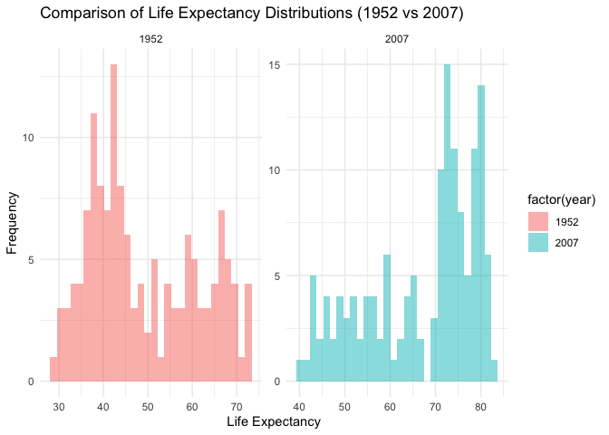
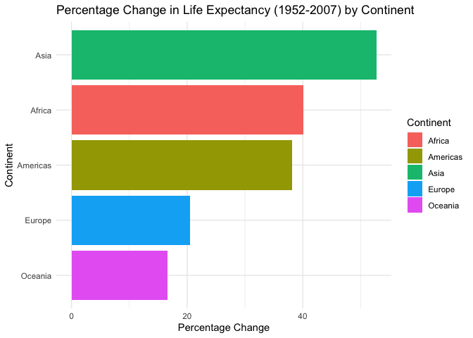
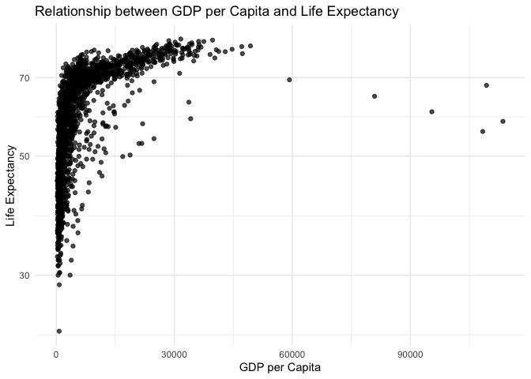
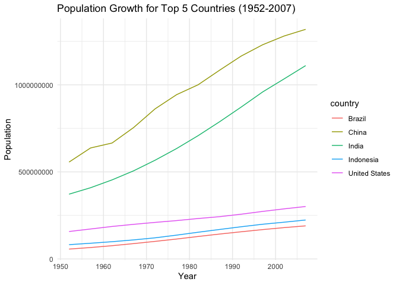
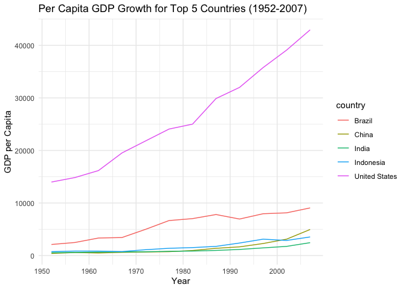
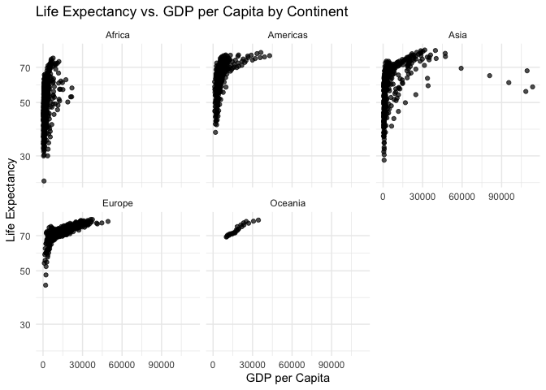

## Instructions
Answer the following questions and complete the exercises in RMarkdown. Please embed all of your code and push your final work to your repository. Your final lab report should be organized, clean, and run free from errors. Remember, you must remove the `#` for the included code chunks to run. Be sure to add your name to the author header above. For any included plots, make sure they are clearly labeled. You are free to use any plot type that you feel best communicates the results of your analysis.  

**In this homework, you should make use of the aesthetics you have learned. It's OK to be flashy!**

Make sure to use the formatting conventions of RMarkdown to make your report neat and clean!  

## Load the libraries

```r
library(tidyverse)
library(janitor)
library(here)
library(naniar)
```


```r
options(scipen = 999)
```

## Resources
The idea for this assignment came from [Rebecca Barter's](http://www.rebeccabarter.com/blog/2017-11-17-ggplot2_tutorial/) ggplot tutorial so if you get stuck this is a good place to have a look.  

## Gapminder
For this assignment, we are going to use the dataset [gapminder](https://cran.r-project.org/web/packages/gapminder/index.html). Gapminder includes information about economics, population, and life expectancy from countries all over the world. You will need to install it before use. This is the same data that we will use for midterm 2 so this is good practice.

```r
#install.packages("gapminder")
library("gapminder")
```

## Questions
The questions below are open-ended and have many possible solutions. Your approach should, where appropriate, include numerical summaries and visuals. Be creative; assume you are building an analysis that you would ultimately present to an audience of stakeholders. Feel free to try out different `geoms` if they more clearly present your results.  

**1. Use the function(s) of your choice to get an idea of the overall structure of the data frame, including its dimensions, column names, variable classes, etc. As part of this, determine how NAs are treated in the data.**  


```r
glimpse(gapminder)
```

```
## Rows: 1,704
## Columns: 6
## $ country   <fct> "Afghanistan", "Afghanistan", "Afghanistan", "Afghanistan", …
## $ continent <fct> Asia, Asia, Asia, Asia, Asia, Asia, Asia, Asia, Asia, Asia, …
## $ year      <int> 1952, 1957, 1962, 1967, 1972, 1977, 1982, 1987, 1992, 1997, …
## $ lifeExp   <dbl> 28.801, 30.332, 31.997, 34.020, 36.088, 38.438, 39.854, 40.8…
## $ pop       <int> 8425333, 9240934, 10267083, 11537966, 13079460, 14880372, 12…
## $ gdpPercap <dbl> 779.4453, 820.8530, 853.1007, 836.1971, 739.9811, 786.1134, …
```
**2. Among the interesting variables in gapminder is life expectancy. How has global life expectancy changed between 1952 and 2007?**

```r
gapminder %>%
  group_by(year) %>%
  summarize(avg_life_exp = mean(lifeExp))
```

```
## # A tibble: 12 × 2
##     year avg_life_exp
##    <int>        <dbl>
##  1  1952         49.1
##  2  1957         51.5
##  3  1962         53.6
##  4  1967         55.7
##  5  1972         57.6
##  6  1977         59.6
##  7  1982         61.5
##  8  1987         63.2
##  9  1992         64.2
## 10  1997         65.0
## 11  2002         65.7
## 12  2007         67.0
```
Life expectancy has increased.
**3. How do the distributions of life expectancy compare for the years 1952 and 2007?**

```r
gapminder %>%
  filter(year %in% c(1952, 2007)) %>%
  ggplot(aes(x = lifeExp, fill = factor(year))) +
  geom_histogram(position = "identity", alpha = 0.5, bins = 30) +
  facet_wrap(~year, scales = "free") +
  labs(title = "Comparison of Life Expectancy Distributions (1952 vs 2007)",
       x = "Life Expectancy",
       y = "Frequency") +
  theme_minimal()
```

<!-- -->
The 1952 distribution has an earlier peak than the 2007 one.

**4. Your answer above doesn't tell the whole story since life expectancy varies by region. Make a summary that shows the min, mean, and max life expectancy by continent for all years represented in the data.**


```r
gapminder %>%
  group_by(continent) %>%
  summarize(min_life_exp = min(lifeExp, na.rm = TRUE),
            mean_life_exp = mean(lifeExp, na.rm = TRUE),
            max_life_exp = max(lifeExp, na.rm = TRUE))
```

```
## # A tibble: 5 × 4
##   continent min_life_exp mean_life_exp max_life_exp
##   <fct>            <dbl>         <dbl>        <dbl>
## 1 Africa            23.6          48.9         76.4
## 2 Americas          37.6          64.7         80.7
## 3 Asia              28.8          60.1         82.6
## 4 Europe            43.6          71.9         81.8
## 5 Oceania           69.1          74.3         81.2
```

**5. How has life expectancy changed between 1952-2007 for each continent?**


```r
life_exp_change <- gapminder %>%
  filter(year %in% c(1952, 2007)) %>%
  group_by(continent, year) %>%
  summarize(mean_life_exp = mean(lifeExp))
```

```
## `summarise()` has grouped output by 'continent'. You can override using the
## `.groups` argument.
```

```r
life_exp_change_pivot <- life_exp_change %>%
  pivot_wider(names_from = year, values_from = mean_life_exp)

life_exp_change_pivot <- life_exp_change_pivot %>%
  mutate(percent_change = ((`2007` - `1952`) / `1952`) * 100)

ggplot(life_exp_change_pivot, aes(x = reorder(continent, percent_change), y = percent_change, fill = continent)) +
  geom_bar(stat = "identity") +
  labs(title = "Percentage Change in Life Expectancy (1952-2007) by Continent",
       x = "Continent",
       y = "Percentage Change",
       fill = "Continent") +
  theme_minimal() +
  coord_flip()
```

<!-- -->


**6. We are interested in the relationship between per capita GDP and life expectancy; i.e. does having more money help you live longer?**


```r
gapminder %>%
  ggplot(aes(x = gdpPercap, y = lifeExp)) +
  geom_point(alpha = 0.7) +
  labs(title = "Relationship between GDP per Capita and Life Expectancy",
       x = "GDP per Capita",
       y = "Life Expectancy") +
  scale_y_log10()+
  theme_minimal()
```

<!-- -->

Yes
**7. Which countries have had the largest population growth since 1952?**


```r
population_growth <- gapminder %>%
  group_by(country) %>%
  summarize(population_growth = last(pop) - first(pop)) %>%
  arrange(desc(population_growth))

population_growth
```

```
## # A tibble: 142 × 2
##    country       population_growth
##    <fct>                     <int>
##  1 China                 762419569
##  2 India                 738396331
##  3 United States         143586947
##  4 Indonesia             141495000
##  5 Brazil                133408087
##  6 Pakistan              127924057
##  7 Bangladesh            103561480
##  8 Nigeria               101912068
##  9 Mexico                 78556574
## 10 Philippines            68638596
## # ℹ 132 more rows
```
China

**8. Use your results from the question above to plot population growth for the top five countries since 1952.**

```r
top_5_countries <- head(population_growth$country, 5)

top_5_data <- gapminder %>%
  filter(country %in% top_5_countries)

ggplot(top_5_data, aes(x = year, y = pop, color = country)) +
  geom_line() +
  labs(title = "Population Growth for Top 5 Countries (1952-2007)",
       x = "Year",
       y = "Population") +
  theme_minimal()
```

<!-- -->


**9. How does per capita GDP growth compare between these same five countries?**

```r
ggplot(top_5_data, aes(x = year, y = gdpPercap, color = country)) +
  geom_line() +
  labs(title = "Per Capita GDP Growth for Top 5 Countries (1952-2007)",
       x = "Year",
       y = "GDP per Capita") +
  theme_minimal()
```

<!-- -->
They are similar

**10. Make one plot of your choice that uses faceting!**


```r
gapminder %>%
  ggplot(aes(x = gdpPercap, y = lifeExp)) +
  geom_point(alpha = 0.7) +
  facet_wrap(~continent) +
  labs(title = "Life Expectancy vs. GDP per Capita by Continent",
       x = "GDP per Capita",
       y = "Life Expectancy") +
  scale_y_log10()+
  theme_minimal()
```

<!-- -->

```r
?facet_wrap
```


## Push your final code to GitHub!
Please be sure that you check the `keep md` file in the knit preferences. 
